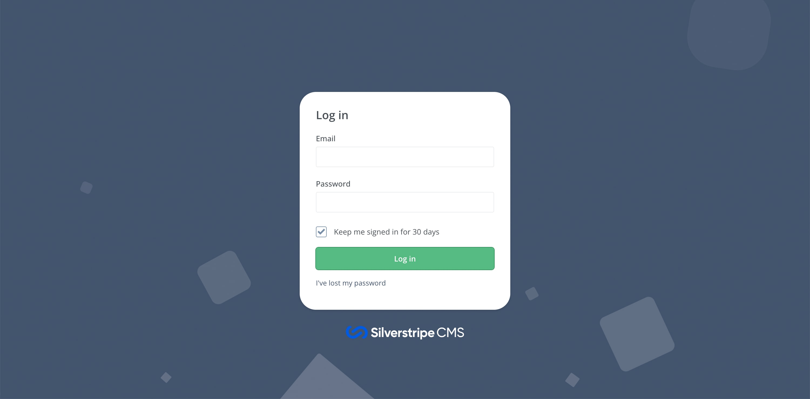
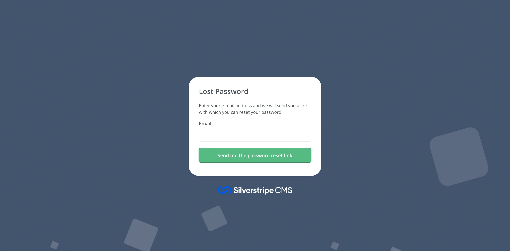
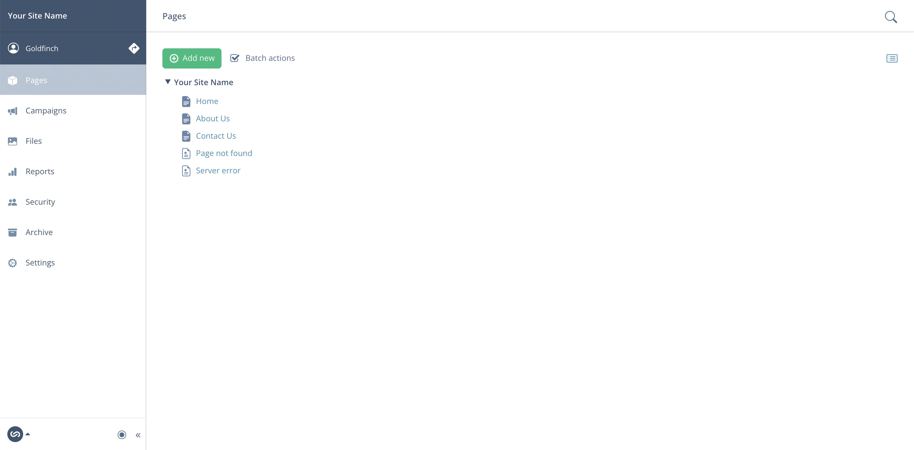
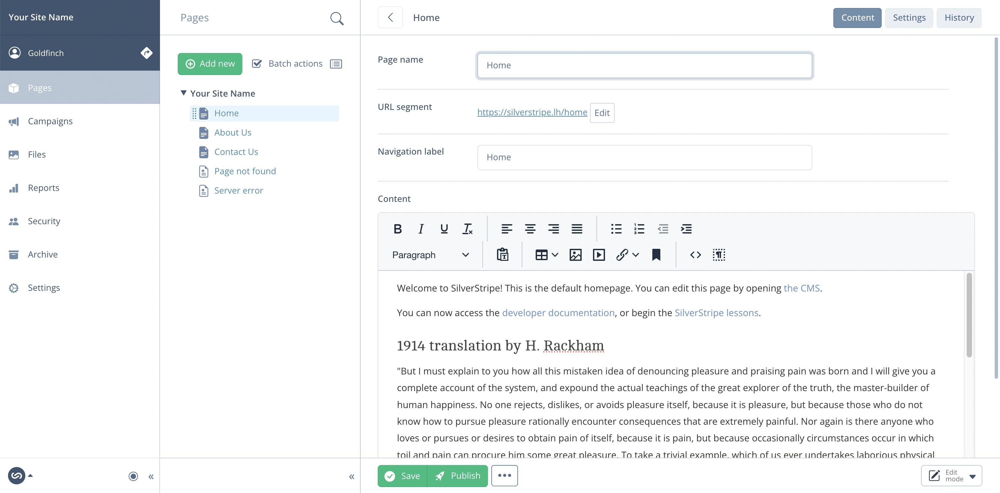
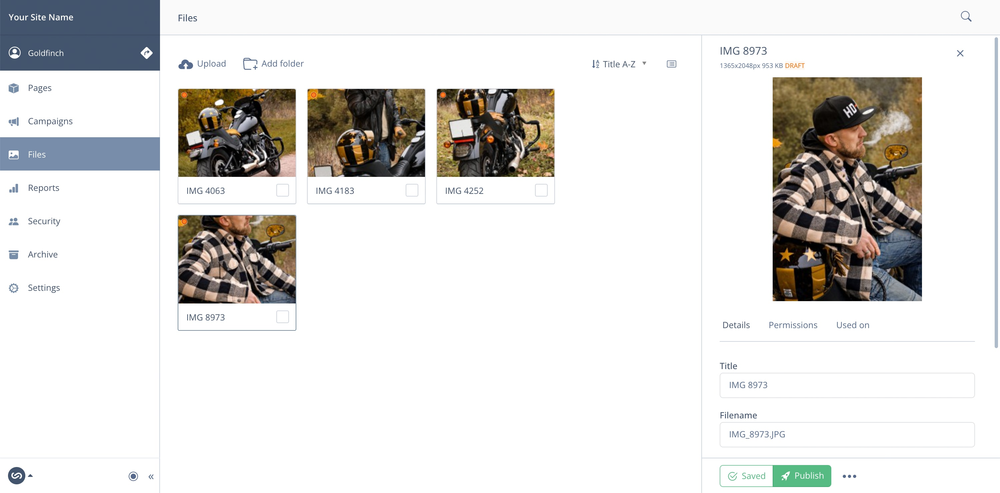
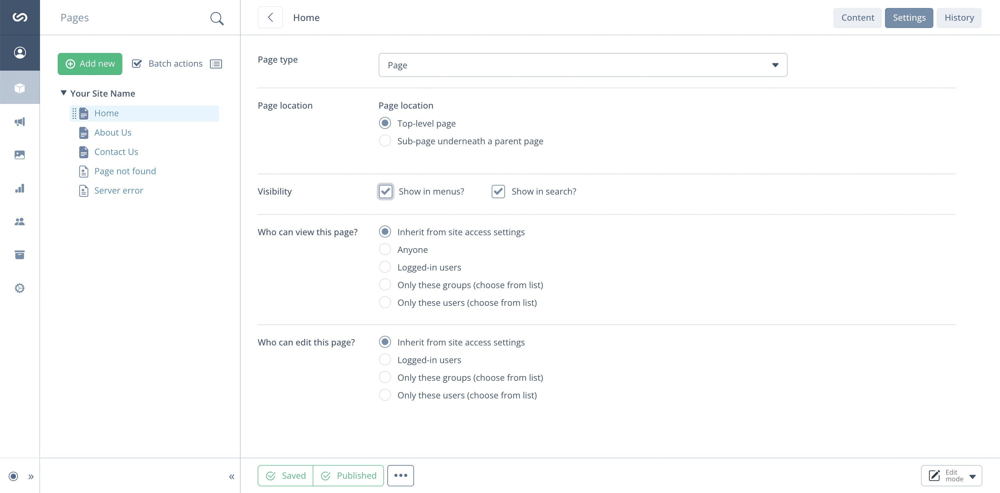

# 🦅 Styled Admin theme for Silverstripe

[](https://packagist.org/packages/spatie/schema-org)
[](https://packagist.org/packages/spatie/schema-org)
[](https://packagist.org/packages/spatie/schema-org)
[](https://packagist.org/packages/spatie/schema-org)

Restyled and 🪄 enhanced admin interface for Silverstripe based on Bootstrap 5 🔮

## Install

```
composer require goldfinch/enchantment
```

.env

```
SS_THEME_ENCHANTMENT=true
```

## Usage

#### Enable/Disable

The new interface is controlled by a switcher in *admin/settings*, for you to easily go back to the original theme if you need to. Go and do that in Settings to see the magic 🧙‍♂️ ✨✨✨

You might need to do a page hard-refresh after enabling/disabling it.

#### Icons

**Bootstrap Icons** are included. Go and use it for your needs:

https://icons.getbootstrap.com/

```php
class MyAwesomeAdmin extends ModelAdmin
{
    private static $menu_icon_class = 'bi-fire';
}
```

## Previews

#### Login page

#### Lost password page

#### Page tree

#### Page

#### Assets

#### Page Settings


## License

The MIT License (MIT)
